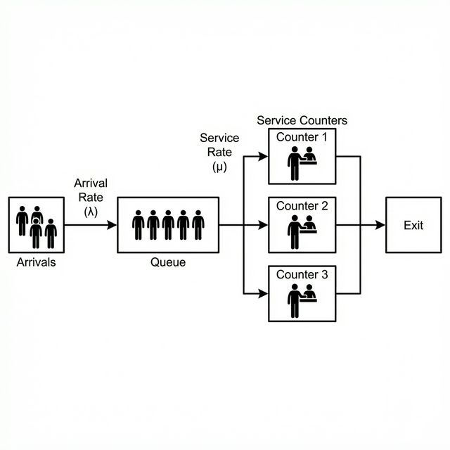
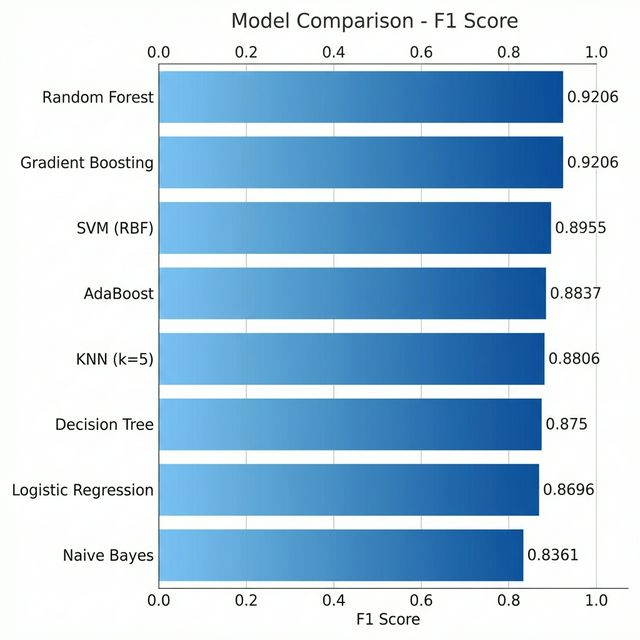

# SimPy Queue Simulation & Machine Learning

## Modeling and Simulation Mini Project | Assignment-6

---

## Project Overview

This project demonstrates data generation using modeling and simulation to create a synthetic dataset for machine learning.

We simulate a bank queuing system using **SimPy**, a process-based discrete-event simulation framework, and train multiple machine learning models to predict whether the system becomes overloaded based on initial queue parameters.

The objective is to:
- Generate 1000 simulation samples
- Build a synthetic dataset
- Train multiple ML classifiers
- Compare models using evaluation metrics
- Identify the best performing model

---

## Simulation Model – Bank Queuing System (SimPy)



SimPy is a process-based discrete-event simulation framework based on Python. It is listed on the [Wikipedia List of Computer Simulation Software](https://en.wikipedia.org/wiki/List_of_computer_simulation_software).

The simulation models a bank with multiple counters serving arriving customers:

- Customers arrive following an exponential distribution based on arrival rate
- Each counter serves customers with exponentially distributed service times
- If all counters are busy, customers wait in a queue
- The simulation runs for a fixed duration and records queue metrics

### Simulation Parameters and Bounds

| Parameter | Lower Bound | Upper Bound | Description |
|-----------|-------------|-------------|-------------|
| arrival_rate | 0.5 | 5.0 | Customer arrivals per minute |
| service_rate | 0.3 | 3.0 | Service completions per minute |
| num_counters | 1 | 5 | Number of service counters |

---

## Project Structure

```
Data-Generation-using-Modelling-and-Simulation/
│
├── data/
│   └── queue_dataset.csv
│
├── results/
│   ├── model_comparison.csv
│   └── best_model.csv
│
├── src/
│   ├── simulation.py
│   ├── dataset_builder.py
│   ├── train_models.py
│   └── run_pipeline.py
│
├── requirements.txt
├── .gitignore
└── README.md
```

---

## Installation

Install required packages:

```
pip install -r requirements.txt
```

---

## How to Run

From inside the `src` folder:

```
python run_pipeline.py
```

This will:

1. Generate 1000 queue simulations  
2. Create a synthetic dataset  
3. Train 8 classification models  
4. Evaluate models  
5. Save results inside the `results/` folder  

---

## Model Comparison Results

| Model | Accuracy | Precision | Recall | F1_Score | ROC_AUC | Train_Time_sec | Rank |
|-----------|----------|-----------|--------|----------|----------|----------------|------|
| Random Forest | 0.95 | 0.9206 | 0.9206 | 0.9206 | 0.9904 | 0.153 | 1 |
| Gradient Boosting | 0.95 | 0.9206 | 0.9206 | 0.9206 | 0.9911 | 0.184 | 2 |
| SVM (RBF) | 0.93 | 0.8451 | 0.9524 | 0.8955 | 0.9903 | 0.041 | 3 |
| AdaBoost | 0.925 | 0.8636 | 0.9048 | 0.8837 | 0.9907 | 0.161 | 4 |
| KNN (k=5) | 0.92 | 0.831 | 0.9365 | 0.8806 | 0.9776 | 0.008 | 5 |
| Decision Tree | 0.92 | 0.8615 | 0.8889 | 0.875 | 0.9116 | 0.003 | 6 |
| Logistic Regression | 0.91 | 0.8 | 0.9524 | 0.8696 | 0.9803 | 0.006 | 7 |
| Naive Bayes | 0.9 | 0.8644 | 0.8095 | 0.8361 | 0.9703 | 0.003 | 8 |



---

## Dataset Description

Each simulation generates the following features:

| Feature | Description |
|----------|------------|
| arrival_rate | Customer arrival rate (per minute) |
| service_rate | Service completion rate (per minute) |
| num_counters | Number of service counters |
| avg_wait_time | Average customer wait time |
| max_wait_time | Maximum customer wait time |
| total_served | Total customers served |
| customers_left | Customers still waiting at end |
| overloaded | 0 = Normal, 1 = Overloaded (avg wait > 5 min) |

For model training, only initial parameters (arrival_rate, service_rate, num_counters) are used to avoid data leakage.

---

## Machine Learning Models Used

The following classification models were evaluated:

- Random Forest
- Gradient Boosting
- AdaBoost
- SVM (RBF Kernel)
- K-Nearest Neighbors (k=5)
- Logistic Regression
- Decision Tree
- Naive Bayes

---

## Evaluation Metrics

Models were evaluated using:

- Accuracy
- Precision
- Recall
- F1 Score
- ROC-AUC

Models are ranked using integer ranking based on F1 Score.

---

## Output Files

After execution, the following files are generated:

- `results/model_comparison.csv` → Full comparison table  
- `results/best_model.csv` → Best performing model  

---

## Conclusion

This project demonstrates how simulation-based synthetic data can be used to train and compare multiple machine learning models.  

The best model is selected based on F1 Score, ensuring balanced classification performance for queue overload prediction.

---

## Author

- Vishard Mehta
- 102317240

---